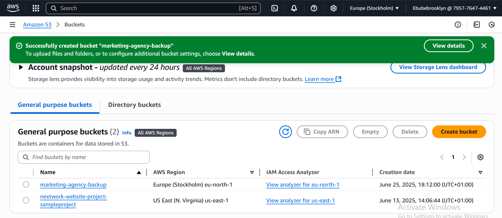
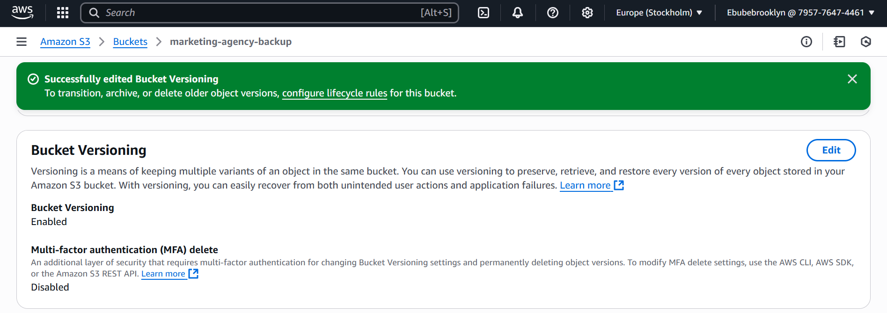
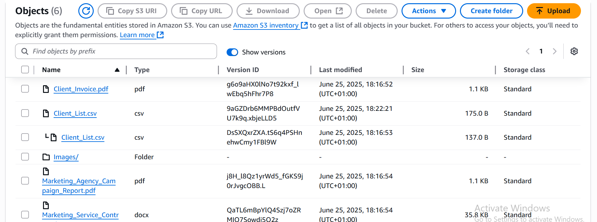
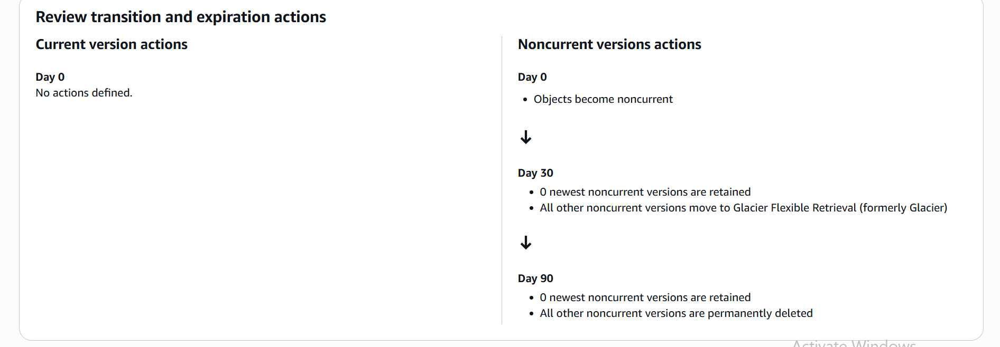

# 📦 AWS S3 Backup-lifecycle & versioning System for a Marketing Agency 

This project demonstrates how to build a version-controlled and cost-effective cloud backup system for a pretend Marketing Agency using **AWS S3**. It includes:

- ✅ Object versioning
- ✅ Lifecycle policies for archival and cleanup
- ✅ File organization (including marketing assets and documents)
- ✅ Full documentation with screenshots

---

## 🏗️ Project Structure

```bash
aws-s3-lifecycle-versioning-system/
├── s3-bucket-objects/            # Files uploaded to the S3 bucket
│   ├── Marketing_Agency_Campaign_Report.pdf
│   ├── Client_Invoice.pdf
│   ├── Client_List.csv
│   ├── Marketing_Service_Contract.docx
│   └── images/                   # Image assets grouped separately
│       ├── austin-distel-gUIJ0YszPig-unsplash.jpg
│       └── austin-distel-mpN7xjKQ_Ns-unsplash.jpg ....

│
├── s3-setup-screenshots/         # Screenshots of AWS S3 setup steps
│   ├── 01-s3-bucket-created-marketing-agency.png
│   ├── 02-s3-versioning-enabled.png
│   ├── 03-s3-files-uploaded-object-list.png
│   ├── 04-s3-file-version-history-client-list.png
│   └── 05-s3-lifecycle-rule-glacier-delete-summary.png
│
└── README.md
```

🔐 S3 Configuration Summary

✅ Bucket Created

Name: marketing-agency-backup
Region: Europe (Stockholm) eu-north-1
All access left private by default

📸 *Screenshot:*  



🔄 Versioning Enabled

Versioning was enabled to preserve every modification to files.
This allows restoration of deleted or overwritten files.

📸 *Screenshot:*  



📂 Files Uploaded to S3

All marketing documents and media were uploaded, including images grouped inside an /images folder.

📸 *Screenshot:*  


🧬 Version Control Verified

A test edit was made to Client_List.csv and re-uploaded. S3 retained both file versions automatically.

📸 *Screenshot:*  



🔁 Lifecycle Rule Applied

A rule was created to:

✅ Transition noncurrent versions to Glacier Flexible Retrieval after 30 days

✅ Permanently delete noncurrent versions after 90 days

This ensures archived files are low-cost and automatically cleaned up over time.

📸 *Screenshot:*  



💡 AWS Glacier Storage Tip

When transitioning to Glacier (or any archival tier), AWS applies a minimum storage duration:

Class	Minimum Charge Duration
Glacier Instant Retrieval	30 days
Glacier Flexible Retrieval	30 days
Glacier Deep Archive	90 days

🔍 If a file is deleted before this period ends, you're still billed for the full minimum duration.
✅ In this project, files are only deleted after 90 days — making this lifecycle rule cost-aligned and optimized.

🧠 What This Project Demonstrates

✅ Real-world use of AWS S3 versioning
✅ Smart lifecycle automation
✅ Cost-awareness with Glacier tiers
✅ Clean file structure and repo documentation
✅ Screenshot evidence of infrastructure setup
✅ Ready to showcase on GitHub and LinkedIn

## 🧑‍💻 Created by

**Ebube Iloegbunam Brooklyn** — AWS Cloud Projects  
📫 [LinkedIn](https://www.linkedin.com/in/ebube-iloegbunam-brooklyn)